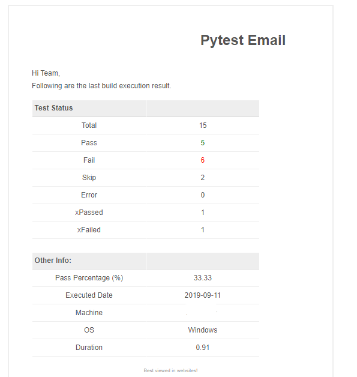

# pytest-email


Plugin to send email after execution with results.

[](https://badge.fury.io/py/pytest-email)
[](https://pepy.tech/project/pytest-email)
[]()
[]()
[]()

---

### How it works:

 - Get execution details using  `pytest_terminal_summary()` hook
 - Build html template
 - Send's email for respective recipients

---

### How to use in project:

1. Install `pytest-email`

   > Case 1: Using pip
   ```
   pip install pytest-email
   ```
   
   > Case 2: Using `setup.py` (clone repo and run command in root)
   ```
   python setup.py install
   ```

   > Case 3: Install from git (changes in master)
   ```
   pip install git+https://github.com/adiralashiva8/pytest-email
   ```

2. Execute test's normally using options

    ```
    pytest --euname="test@gmail.com" --epwd="XXXXX" --eto="test1@gmail.com,test2@gmail.com"
    ```

    > By default send email is false, users need to enable send email by using following command 
    ```
    pytest --esend=True
    ```

    Email options:
    ```
    -> --euname - Email user name or id
    -> --epwd - Email user password
    -> --eto - Recipients email ids
    -> --esmtp - Email server smtp
    -> --esubject - Email subject
    -> --eorg - Organization name to include in email
    -> --esend - Send email based on input
    ```

    __USAGE__
    ```
    pytest --esend=True --euname="test@gmail.com" --epwd="XXXXX" --eto="test1@gmail.com,test2@gmail.com" --esubject="ABC Project Execution" --eorg="MyCompany" --esmtp="smtp.xxxx.4578"
    ```
---

*Sample Report*



---

### What kind of information is shared?

Following test counts:
- Total
- Passed
- Failed
- Skipped
- Error
- XPassed
- XFailed
- Duration

Future: Failed test information

---

*Thanks for using pytest-email!*

If you have any questions / suggestions / comments on this, please feel free to reach me at

 - Email: <a href="mailto:adiralashiva8@gmail.com?Subject=Pytest%20Email" target="_blank">`adiralashiva8@gmail.com`</a> 
 - LinkedIn: <a href="https://www.linkedin.com/in/shivaprasadadirala/" target="_blank">`shivaprasadadirala`</a>
 - Twitter: <a href="https://twitter.com/ShivaAdirala" target="_blank">`@ShivaAdirala`</a>

---

*Credits*

 - [Pytest-dev](https://github.com/pytest-dev)
 - [Stackoverflow](https://stackoverflow.com/questions/tagged/pytest)

---

 :star: repo if you like it
